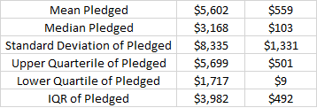

# An Analysis of Kickstarter Campaigns
Trends in Kickstarter Data for Louise

## Charts/Images
- Success/Failure by Category (All countries)

- Success/Failure by Subcategory (All countries)

- Theater Outcomes Based on Launch Date

- US Kickstarters Descriptive Statistics: Goals

  
- US Kickstarters Descriptive Statistics: Pledged

## Recommendations
1. Theater has the most successful outcomes, followed by music, film and video, and technology, respectively.
2. Within Theater, plays are the most successful subcategory, followed by spaces, and musicals.
3. May and June were the most successful months to 

