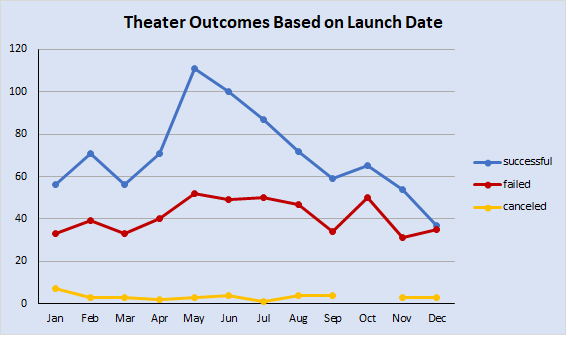
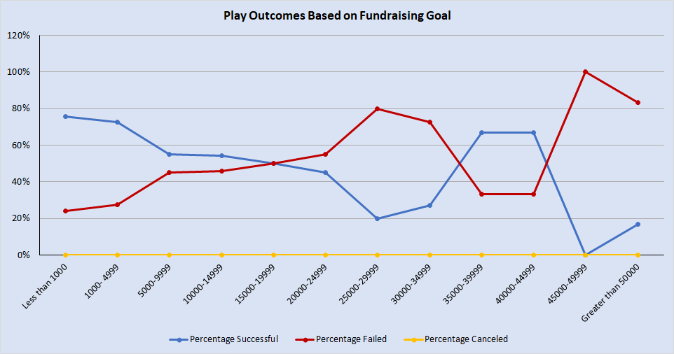

# Kickstarting with Excel

## Overview of Project

### Following Louise's funding campaign for her play Fever, she wanted to better understand the relationship, if any, between a campaign's launch date and a campaign's funding goals. To help Louise understand these relationships I combed through the Kickstarter dataset and created two charts to visualize how a campaign's launch date and funding goals might affect its outcomes.

## Analysis and Challenges

### Analysis of Outcomes Based on Launch Date

#### To prepare for this visualization, I first created a new "Years" column in the dataset that would extract the year from the existing "Date Created Conversion" column. This would make sorting and analyzing the data easier within a pivot table and would produce a cleaner and more effective x-axis for the visualization. With the data ready, I then created the pivot table, being sure to break out the campaign outcomes by month for easier viewing. I added a years filter in case Louise wanted to see how campaign's fared year to year, but left the filter untouched so she could see the aggregated outcomes from all years (2009-2017). To make the visualization more applicable to Louise's campaign, I filtered out all the parent categories except for theater. With the pivot table ready, I chose to create a line chart because of its ability to effectively visualize data trends over time. In the chart below, Louise can see the total number of successful, failed, and canceled theater campaigns from 2009-2017.

[Review the "Theater Outcomes by Launch Date" tab in this spreadsheet for a closer look at the data:](Kickstarter_Challenge.xlsx)

### Analysis of Outcomes Based on Goals

#### To prepare for this visualization, I created a new sheet with a table that broke down fundraising goal amounts into 12 separate buckets (e.g., less than 1000, 1000-4999). Using the countifs() function, I calculated the number of successful, failed, and canceled plays for each fundraising goal range. Afterwards, I created a column that totaled the number of successful, failed, and canceled plays. With this column in place, I then proceeded to divide each the number of successful, failed, and canceled plays by the total number of plays in order to calculate the percentage of the whole for each outcome. In the chart below, Louise can see the percentage of successful, failed, and canceled plays across each fundraising goal range. (review the "Outcomes Based on Goals" tab in the spre)

[Review the "Outcomes Based on Goals" tab in this spreadsheet for a closer look at the data:](Kickstarter_Challenge.xlsx)

### Challenges and Difficulties Encountered

## Results

- What are two conclusions you can draw about the Outcomes based on Launch Date?

- What can you conclude about the Outcomes based on Goals?

- What are some limitations of this dataset?

- What are some other possible tables and/or graphs that we could create?
